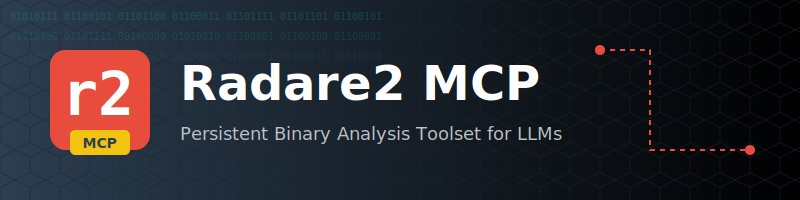

<p align="center">
  
</p>

# Radare2 MCP

A persistent binary analysis toolset for LLMs, powered by [Radare2](https://github.com/radareorg/radare2).

## Why?

Security researchers often need to perform deep, incremental analysis of binaries. Standard LLM context windows make it difficult to maintain state (like renamed symbols, comments, or identified vulnerabilities) across multiple turns. 

**Radare2 MCP** solves this by providing a persistent analysis environment. Every binary analyzed is tracked as a Radare2 project, ensuring that your insights persist and the LLM can "pick up where it left off."

## Capabilities & Tool Reference

Radare2 MCP provides a wide array of tools categorized by their role in the binary analysis lifecycle.

### 🛠 Tool Overview

| Category | Tool Name | Description | Key Features |
| :--- | :--- | :--- | :--- |
| **Static Analysis** | `get_r2_decompile` | High-level pseudo-code generation. | Supports Ghidra, r2dec, and native backends. |
| | `get_r2_disassemble` | Low-level assembly listing. | Configurable instruction count and address. |
| | `get_r2_binary_info` | Metadata and architecture details. | Arch, bits, endianness, and compiler info. |
| | `get_r2_list_imports` | Enumerates imported symbols. | Detects dangerous sinks (e.g., `strcpy`, `system`). |
| **Interactive Debug** | `r2_debug_start` | Spawns a new debug session. | Handles ASLR and environment setup. |
| | `r2_debug_action` | Controls execution (step, cont). | Breakpoints, stepping, and signal handling. |
| | `r2_debug_read_state` | Captures live process context. | Full register sets and current instruction. |
| **Exploit Research** | `get_r2_rop_gadgets` | Searches for ROP primitives. | Regex-based gadget filtering. |
| | `get_r2_analyze_mitigations` | Audits binary protections. | NX, Canary, PIE, RELRO, ASLR. |
| | `get_r2_get_xrefs` | Finds cross-references (XREFs). | Trace where data/functions are used. |
| **Persistence** | `get_r2_rename_symbol` | Renames functions or offsets. | Changes persist in the `.r2_projects/` database. |
| | `get_r2_set_comment` | Annotates the disassembly. | Add researcher notes to specific addresses. |
| **Modification** | `get_r2_patch_asm` | Rewrites code via assembly. | NOP-out checks or redirect branches. |
| | `get_r2_patch_hex` | Direct byte-level patching. | Precise modification of data or code. |
| **Advanced** | `get_r2_emulate_function` | ESIL-based static emulation. | Predict register state without execution. |
| | `get_r2_define_type` | C-style type management. | Define structs, unions, and typedefs. |

---

## Detailed Usage Guide

### 🔍 Deep Analysis
> "Analyze the binary at `samples/test_binary`. Find the `main` function, show me its disassembly, and then provide the Ghidra-style pseudo-code."

1. **Information Gathering**: The agent uses `get_r2_binary_info` to understand the target.
2. **Locating**: Uses `get_r2_disassemble(address_or_symbol="main")`.
3. **Decompiling**: Uses `get_r2_decompile(address_or_symbol="main")`.

### 🐞 Live Debugging
> "Debug `samples/test_binary`. Set a breakpoint at the address where it calls `strcpy`, run it, and tell me what's in the RDI register when it hits."

1. **Initialization**: `r2_debug_start(file_path="samples/test_binary")`.
2. **Control**: `r2_debug_action(action="db sym.imp.strcpy")` then `r2_debug_action(action="dc")`.
3. **Inspection**: `r2_debug_read_state()` to extract register values.

### 🛠 Binary Surgery
> "I found a license check at `0x11ab` that returns 0 on failure. Patch the binary so it always returns 1."

1. **Research**: Verify the instruction with `get_r2_disassemble`.
2. **Action**: `get_r2_patch_asm(instruction="mov eax, 1; ret")`.
3. **Verification**: Re-disassemble to confirm the patch.

### 🧠 Persistence & Knowledge Building
Unlike raw Radare2, the MCP environment **remembers**. If you rename a function in one turn, every future tool call in that project will use the new name. This allows for long-term, incremental reverse engineering of complex targets.

## Prerequisites

- Python 3.12+ (if running locally)
- [Radare2](https://github.com/radareorg/radare2) (must be in your `$PATH`)
- [uv](https://github.com/astral-sh/uv) (recommended)
- [Docker](https://www.docker.com/) (optional, for containerized execution)

## Installation

### Local Setup (with uv)

```bash
uv run main.py
```

### Docker Setup

```bash
docker build -t radare2-mcp .
# Run the server
docker run -i --rm radare2-mcp
```

## Agent Configuration

### Claude Desktop

Edit your `config.json` (typically `~/Library/Application Support/Claude/config.json` on macOS):

**Docker Version (Recommended):**
```json
{
  "mcpServers": {
    "radare2": {
      "command": "docker",
      "args": [
        "run",
        "-i",
        "--rm",
        "-v", "radare2-cache:/app/.r2_projects",
        "-v", "<path-to-your-binaries>:/data",
        "radare2-mcp"
      ]
    }
  }
}
```

### Cursor

1. Go to **Settings > Features > MCP**.
2. Click **+ Add New MCP Server**.
3. Name: `Radare2 MCP`
4. Type: `command`
5. Command: `uv run --project <path-to-repo> main.py`

### Windsurf

Add to your `mcp_config.json`:

```json
{
  "mcpServers": {
    "radare2": {
      "command": "uv",
      "args": [
        "run",
        "--project",
        "<path-to-repo>",
        "main.py"
      ]
    }
  }
}
```

## Persistence

All analysis data is stored in the `.r2_projects/` directory. If using Docker, ensure you mount a volume to this path to keep your analysis across sessions.

## License

This project is licensed under the MIT License - see the [LICENSE](LICENSE) file for details.
